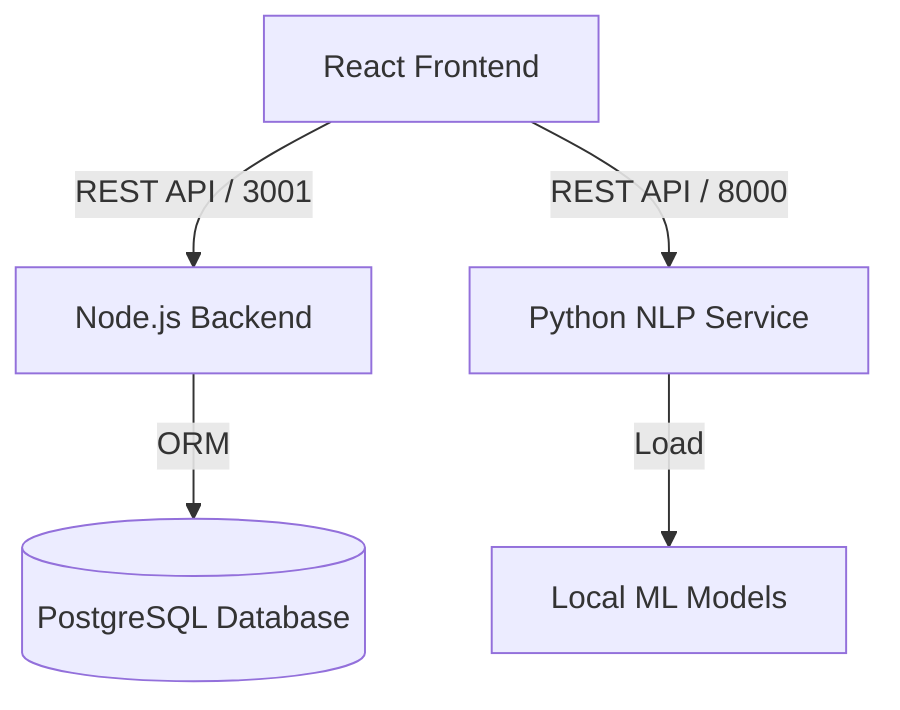

# Software Engineering Documentation
## Subtitles Management System

### 1. System Overview
The **Subtitles Management System** is a full-stack web application designed to help users manage, edit, and translate subtitle files. Key features include project organization, user authentication, and a specialized integration with a custom local NLP model for automated translation (specifically optimized for Chinese-Vietnamese translation).

### 2. Architecture Overview
The system follows a microservices-inspired architecture with a decoupled frontend and two distinct backend services:

1.  **Frontend**: A Single Page Application (SPA) built with React.
2.  **Core Backend**: A Node.js/Express REST API handling business logic, data persistence, and authentication.
3.  **NLP Service**: A Python/FastAPI service dedicated to running heavy machine learning inference tasks.

#### High-Level Architecture


### 3. Technology Stack

#### Frontend
*   **Framework**: React 18 (via Vite)
*   **Language**: TypeScript
*   **Styling**: Tailwind CSS, PostCSS
*   **UI Components**: Radix UI (Headless), Shadcn UI (Component logic), Lucide React (Icons)
*   **State Management**: React Context API, React Hook Form
*   **Utilities**: `clsx`, `tailwind-merge`

#### Core Backend (API)
*   **Runtime**: Node.js
*   **Framework**: Express.js
*   **Language**: TypeScript (`tsx` for execution)
*   **Database**: PostgreSQL
*   **ORM**: Prisma
*   **Authentication**: JSON Web Tokens (JWT), bcryptjs
*   **Security**: CORS

#### NLP Backend (AI Service)
*   **Framework**: FastAPI
*   **Language**: Python 3.x
*   **ML Libraries**: PyTorch, Hugging Face Transformers (`AutoModelForSeq2SeqLM`)
*   **Server**: Uvicorn
*   **Features**: Dynamic model loading, GPU acceleration support (CUDA)

### 4. Database Schema
The database is managed via Prisma. The Data Model consists of three main entities:

**User**
*   `id`: UUID
*   `email`: Unique identifier
*   `password`: Hashed
*   `projects`: Relation to Projects

**Project**
*   `id`: UUID
*   `name`, `description`
*   `userId`: Foreign Key to User
*   `files`: Relation to SubtitleFiles

**SubtitleFile**
*   `id`: UUID
*   `name`: Filename
*   `content`: Text content (Subtitles)
*   `status`: 'not-started', 'in-progress', 'done'
*   `progress`: Integer (0-100)
*   `projectId`: Foreign Key to Project

### 5. Services & API Reference

#### Core Backend (`server/index.ts`)
*   **Auth**: `/api/auth/register`, `/api/auth/login`, `/api/auth/me`
*   **Users**: `/api/users` (CRUD)
*   **Projects**: `/api/projects` (Manage user projects)
*   **Files**: `/api/files` (Upload and manage subtitle content)

#### NLP Service (`server/python_service/main.py`)
*   **Translation**: `POST /translate` - Accepts text, returns translated string using loaded model.
*   **Versioning**: 
    *   `GET /versions`: List available local model versions.
    *   `POST /set_version`: Hot-swap the active model.
*   **Health**: `GET /health` - Checks model status and device (CPU/CUDA).

### 6. Codebase Structure

```
/
├── prisma/                  # Database schema and migrations
├── scripts/                 # Utility scripts
├── server/
│   ├── index.ts             # Node.js Express entry point
│   └── python_service/      # Python FastAPI application
│       ├── main.py          # FastAPI entry point
│       ├── model/           # Legacy model path
│       └── versions/        # Versioned model storage
├── src/
│   ├── components/          # React UI components
│   ├── contexts/            # Global state (AuthContext, etc.)
│   ├── hooks/               # Custom React hooks
│   ├── services/            # API clients (customNLP.ts, etc.)
│   └── i18n/                # Internationalization logic
├── .env                     # Environment variables
├── package.json             # NPM dependencies
└── vite.config.ts           # Vite configuration
```

### 7. Key Features Implementation

#### Model Versioning
The system implements a dynamic model versioning system. 
1.  **Storage**: Models are stored in `server/python_service/versions/`.
2.  **Discovery**: The Python service scans this directory using `os` and `glob`.
3.  **Selection**: The frontend fetches available versions via `src/services/customNLP.ts` and allows the user to switch versions in real-time via the Settings page.

#### Authentication Flow
1.  User logs in via Frontend.
2.  Backend issues a JWT (expires in 7 days).
3.  Frontend stores JWT in localStorage (or memory via Context).
4.  Subsequent requests to Node Backend include `Authorization: Bearer <token>`.
5.  Middleware in `server/index.ts` validates the token before granting access to protected routes (Projects, Files).

### 8. Running the System

**Prerequisites**: Node.js, Python 3.8+, PostgreSQL.

1.  **Database**:
    ```bash
    npx prisma generate
    npx prisma db push
    ```

2.  **Node Backend**:
    ```bash
    npm run server
    # Runs at http://localhost:3001
    ```

3.  **Python NLP Service**:
    ```bash
    cd server/python_service
    # Install requirements: pip install -r requirements.txt
    python -m uvicorn main:app --host 0.0.0.0 --port 8000 --reload
    # Runs at http://localhost:8000
    ```

4.  **Frontend**:
    ```bash
    npm run dev
    # Runs at http://localhost:5173 (default Vite port)
    ```
